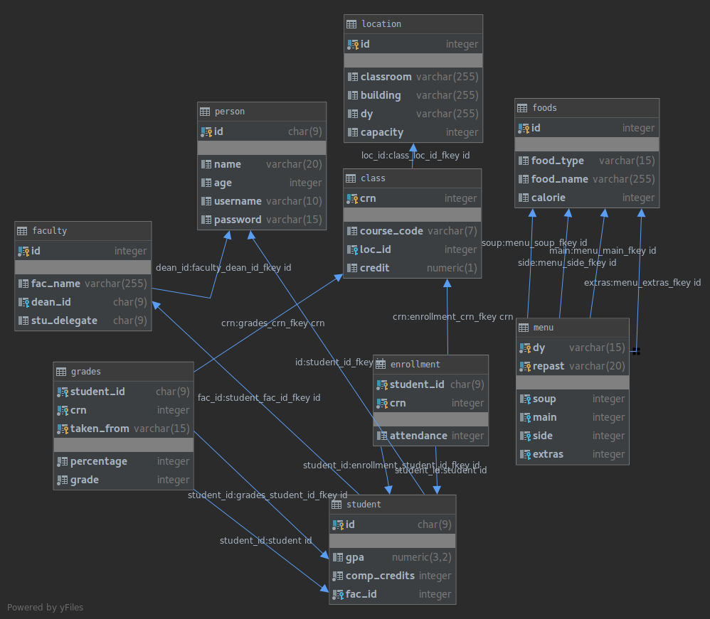

Developer Guide
===============

Database Design
---------------

Explanations
^^^^^^^^^^^^
* Our database has 9 main tables. Their names are foods, menu, person, student, enrollment, grades, class, faculty and location.
* In foods table we have different types of eatables of a repast. A repast has mainly four types of foods: soup, main, side and extras. Also there is calorie value of each food.
* Menu tables keeps the repast menu of a day, which keeps mainly four types of foods from foods table and every day has two different repast as lunch and dinner.
* Person table has information about a student or a lecturer. These persons created and took id, username and password by admin users . In addition to them, person have name and age information too.
* When adding a person if the faculty information of person is entered, then that person becomes a student otherwise person added to system as a lecturer.
.. * A lecturer can do ....
.. * A student user can check their grades, classes which enrolled, attendance info and the menus for foods each day and repast. Also they can enroll a class from enroll to class section.
* Student table exists students' id, which is primary key, gpa numbers in d.dd format, completed credits number and faculty id which foreign key which refers to id in faculty.
* I faculty table there are faculty names, deans' id and student delegate information as in primary key of id.
* There is grades table which keeps to students' grades and which grades taken from which examination how many percentage is effective, and end grade information.
* Also enrollment table keeps how many attendance is there each student in each crn.
* In location table there exist classroom, building, day and capacity. That gives knowledge of the lesson's location ,time and how many people can enroll that lesson.
* Finally, class table keeps the crn numbers, location info referenced from location table, course code which need for student to enroll the classes, and credits of lessons.

**Database E/R diagram**

Code
----

**explain the technical structure of your code**

**to include a code listing, use the following example**::

   .. code-block:: python

      class Foo:

         def __init__(self, x):
            self.x = x

.. toctree::

   member1
   member2
   member3
