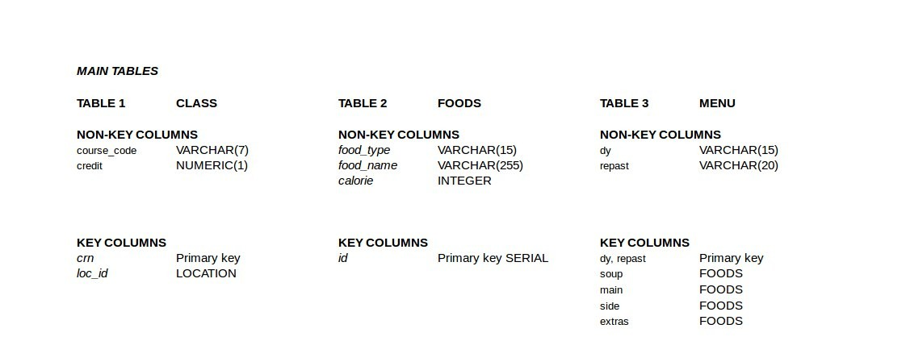
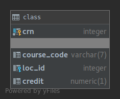
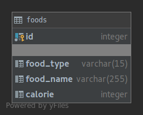
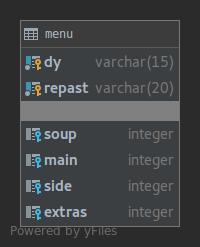

Parts Implemented by Kutay Karakamış
====================================

Tables
------

There are three main tables as in the Figure, these tables keeps foods,
meal menus and class information.

Here is tables:

CLASS
^^^^^
.. code-block:: sql

  CREATE TABLE IF NOT EXISTS CLASS (
    crn INTEGER PRIMARY KEY NOT NULL ,
    course_code VARCHAR(7),
    loc_id INTEGER REFERENCES LOCATION(id) ON DELETE SET NULL,
    credit NUMERIC(1)
  );

FOODS
^^^^^
.. code-block:: sql

  CREATE TABLE IF NOT EXISTS FOODS (
    id SERIAL PRIMARY KEY NOT NULL,
    food_type VARCHAR(15),
    food_name VARCHAR(255),
    calorie INT
  );

MENU
^^^^

.. code-block:: sql
  :linenos:

  CREATE TABLE IF NOT EXISTS MENU (
    dy VARCHAR(15),
    repast VARCHAR(20),
    soup INTEGER,
    main INTEGER,
    side INTEGER,
    extras INTEGER,
    PRIMARY KEY(dy, repast),
    FOREIGN KEY(soup) REFERENCES FOODS(id),
    FOREIGN KEY(main) REFERENCES FOODS(id),
    FOREIGN KEY(side) REFERENCES FOODS(id),
    FOREIGN KEY(extras) REFERENCES FOODS(id)
  );

