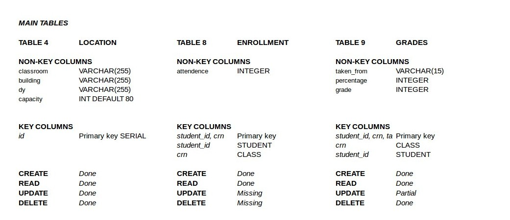
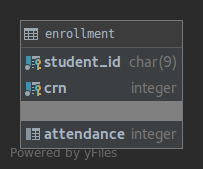
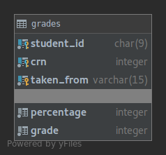

Parts Implemented by Mehmet Fatih Yıldırım
==========================================

Tables
------

There are three main tables as in the Figure, these tables keeps location,
enrollment and grades information.

Here is tables:

.. figure:: ../ss/location.png
  :scale: 50 %
  :alt: map to buried treasure

