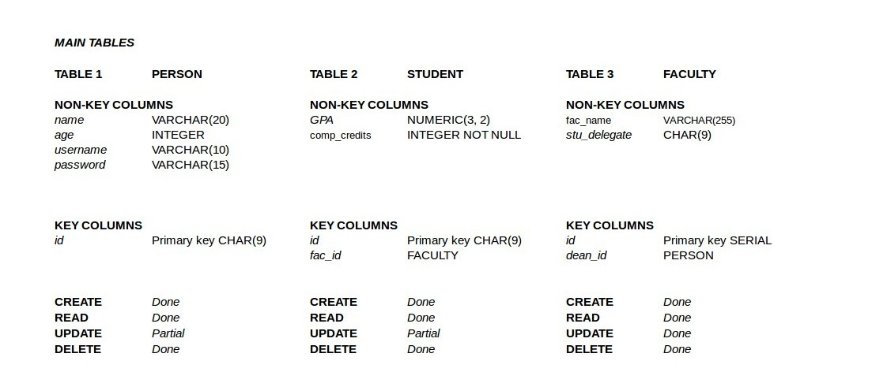
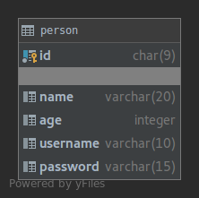
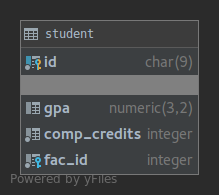
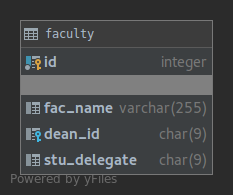

Parts Implemented by Enes Furkan Örnek
======================================

Tables
------

There are three main tables as in the Figure, these tables keeps person,
student and location information.

Tables and their sql codes are like given below:

PERSON
^^^^^^
.. code-block:: sql

  CREATE TABLE IF NOT EXISTS PERSON (
    id CHAR(9) PRIMARY KEY,
    name VARCHAR(20),
    age INTEGER,
    username VARCHAR(10),
    password VARCHAR(15)
  );

STUDENT
^^^^^^^
.. code-block:: sql

  CREATE TABLE IF NOT EXISTS STUDENT (
    ID CHAR(9) PRIMARY KEY NOT NULL REFERENCES PERSON(id) ON DELETE CASCADE,
    GPA NUMERIC(3, 2) DEFAULT NULL,
    COMP_CREDITS INT NOT NULL DEFAULT 0,
    FAC_ID INTEGER REFERENCES FACULTY(id) ON DELETE CASCADE NOT NULL,
    CHECK (COMP_CREDITS >= 0),
    CHECK (GPA >= 0),
    CHECK (GPA <= 4)
  );

FACULTY
^^^^^^^

.. code-block:: sql

  CREATE TABLE IF NOT EXISTS FACULTY (
    id SERIAL PRIMARY KEY NOT NULL,
    fac_name VARCHAR(255),
    dean_id CHAR(9) REFERENCES PERSON(id) ON DELETE SET NULL,
    stu_delegate CHAR(9)
  );

Some example functions of server.py and views.py are given below
++++++++++++++++++++++++++++++++++++++++++++++++++++++++++++++++

Views
^^^^^

**Get Person**

.. code-block:: python

    def get_person(limit=500):
        statement = "SELECT * FROM person LEFT JOIN student ON person.id = student.id WHERE person.name <> 'ADMINISTRATOR'"

        with dbapi2.connect(db_url) as connection:
            with connection.cursor() as cursor:
                cursor.execute(statement)
                records = cursor.fetchall()
                return records

* This function takes the person information from DB and send the server.py.

**Add Person**

.. code-block:: python

    def add_person(per_name, per_num, usern, passw, age, fac):
        if int(age) < 18:
            return 1
        if fac:
            statement = """INSERT INTO person(id, name, age, username, password) VALUES('{}', '{}', '{}', '{}', '{}');
                            INSERT INTO STUDENT(id, fac_id) VALUES('{}','{}')""".format(per_num, per_name, age, usern, passw, per_num, fac)
        else:
            statement = "INSERT INTO person(id, name, age, username, password) VALUES('{}', '{}', '{}', '{}', '{}')".format(
                per_num, per_name, age, usern, passw)
        with dbapi2.connect(db_url) as connection:
            with connection.cursor() as cursor:
                cursor.execute(statement)

* This page add person to DB with checking whether age is more then 18. Also it checks the faculty information is entered or not to identify the person as student or professor.

**Delete Person**

.. code-block:: python

    def del_person(id):
        statement = "DELETE FROM person WHERE id = '{}'".format(id)

        with dbapi2.connect(db_url) as connection:
            with connection.cursor() as cursor:
                cursor.execute(statement)

* Given above function let the admin user to delete person tuple from DB.

Server
^^^^^^

* With this function users who is not login as a correct username and password are not able to enter the pages which requiring permission.
* Almost all page functions in 'server.py' has start with that @allow_to functool. If the user enter the wrong username or password this function direct them to 'forbidden_page' page.

.. code-block:: python

  def allow_to():
      def decorator_let_to(view_func):
          @functools.wraps(view_func)
          def wrapper_view_func(*args, **kwargs):
              user = views.check_user(tabe['username'] , tabe['password'])
              if user:
                  returned_value = view_func(*args, **kwargs)
              else:
                  return redirect(url_for(forbidden_403.__name__))
          return returned_value
      return wrapper_view_func
  return decorator_let_to
