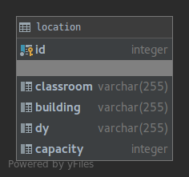

Parts Implemented by Enes Furkan Örnek
======================================

Tables
------

There are three main tables as in the Figure, these tables keeps person,
student and location information.

.. figure:: ../ss/efo.jpg
  :scale: 50 %
  :alt: map to buried treasure

Here is tables:

.. figure:: ../ss/person.png
  :scale: 50 %
  :alt: map to buried treasure

.. figure:: ../ss/student.png
  :scale: 50 %
  :alt: map to buried treasure

