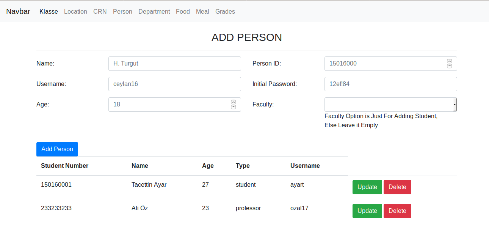
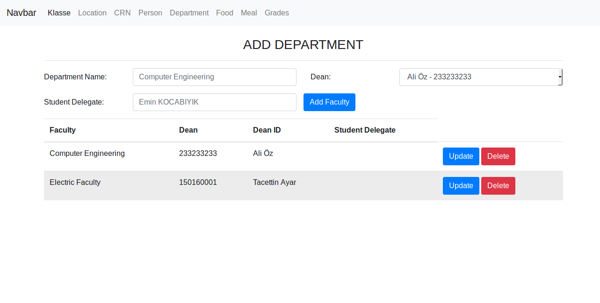
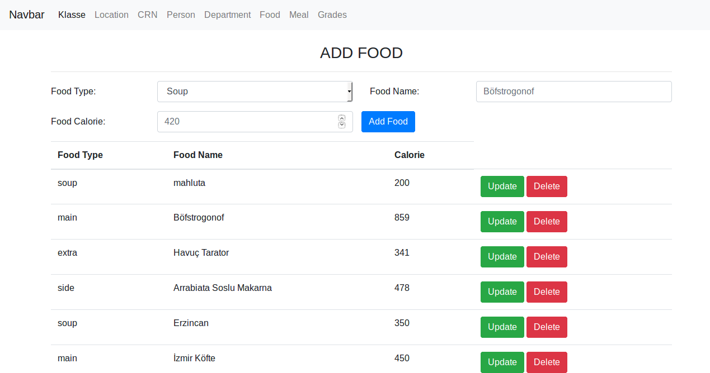
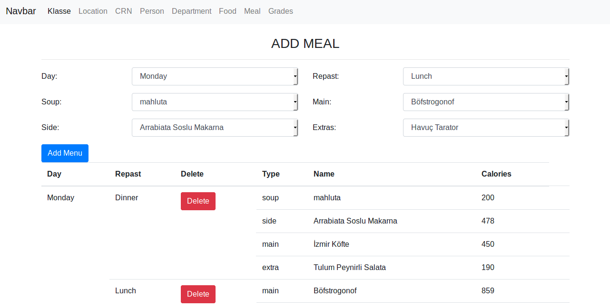
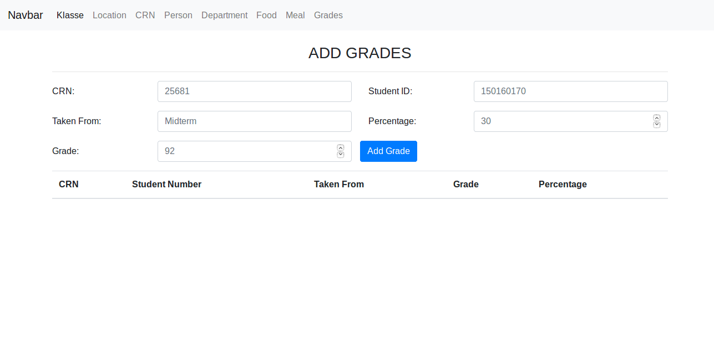

Parts Implemented by Kutay Karakamış
====================================

There are various sections to make some CRUD operations in DB.

CRN
^^^
.. figure:: ../ss/admin-crn.png
  :scale: 50 %
  :alt: map to buried treasure

  http://itucsdb1950.herokuapp.com/admin/location

* In this page admin user can add CRN to table and read, delete a CRN from table.
* CRN has attributes of CRN, course code, location which referenced from location table and credits.
* CRN attribute is identifier of class which has no same features and it is 5-digit number.
* Course code gives the information of lesson's related department, it is generally abbreviation of departments i.e.: BLG, ELK, EHB etc.
* Location referenced from location table and contain its attributes. Therefore to create a CRN at least one tuple must be in the location table.
* Credits take number from 1 to 5.

Person
^^^^^^

  http://itucsdb1950.herokuapp.com/admin/persons

* In this page admin user can add person to table and read, delete a person from table.
* Person has attributes of name, person id, username, password, age and the faculty to identify the person is a student or not.
* Name section takes person's name and surname information.
* Person id is a key variable to identify persons and it is generally 9-digit number but it may differ.
* Username and password are given person to enter the website.
* Age info is important to check the person is at university age and it must be at least 18.
* In department section is optional. If the department is selected, then the person becomes student otherwise person creates as professor automatically.

Department
^^^^^^^^^^

  http://itucsdb1950.herokuapp.com/admin/department

* In this page admin user can add department to table and update, read, delete a department from table.
* Department has attributes of department name, dean which is professor person from person table, and student delegate with optional.
* With update button admin user can make some change at table.

Food
^^^^

  http://itucsdb1950.herokuapp.com/admin/food

* In this page admin user can add food to table and read, delete a person from table.
* Food has attributes of food type, food name and calorie.
* Food type has four different option which are soup, main, side and extras.

Menu
^^^^

  http://itucsdb1950.herokuapp.com/admin/meal

* In this page admin user can add meal to table and read, delete a meal from table.
* Meal has attributes of day, repast, soup, main, side and extras.
* Every repast of days are unique and has mainly four types of foods.
* Day and repast sections form selection feature which keeps days of weeks and lunch and dinner as repast.
* Foods are reference the foods from table, with selecting them admin user can make different menus.

Grades
^^^^^^

  http://itucsdb1950.herokuapp.com/admin/grades

* In this page admin user can add meal to table and read, delete a meal from table.
* Meal has attributes of day, repast, soup, main, side and extras.
* Every repast of days are unique and has mainly four types of foods.
* Day and repast sections form selection feature which keeps days of weeks and lunch and dinner as repast.
* Foods are reference the foods from table, with selecting them admin user can make different menus.

