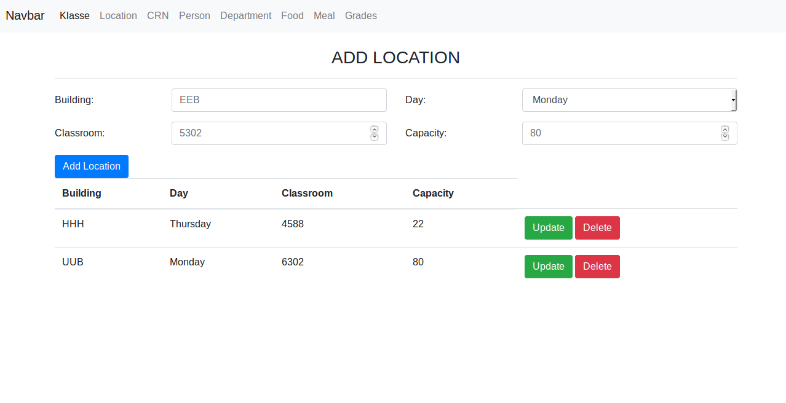
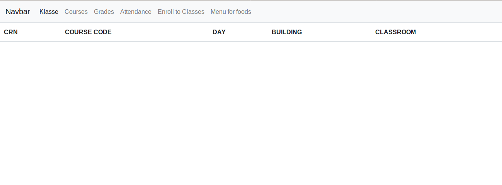
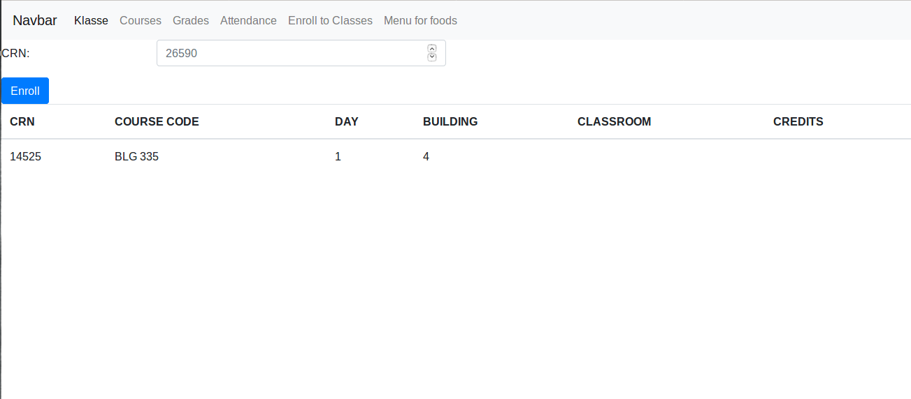
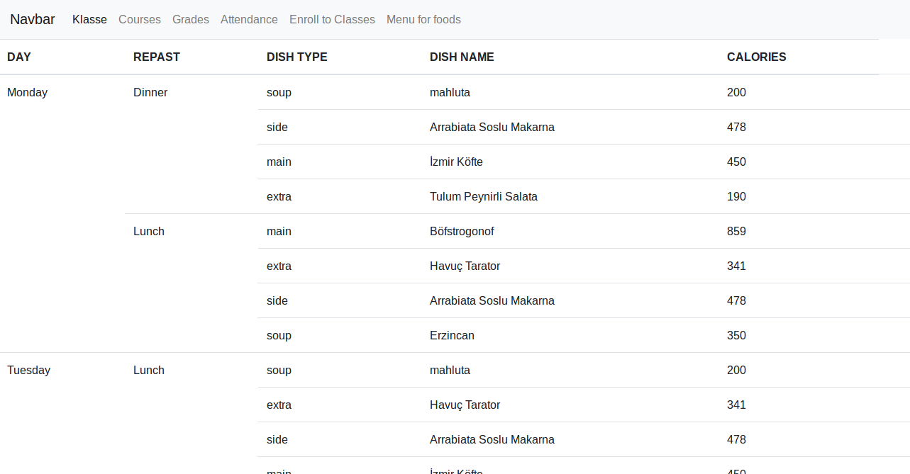

Parts Implemented by Mehmet Fatih Yıldırım
==========================================

Location
^^^^^^^^

  http://itucsdb1950.herokuapp.com/admin/location

* In this page admin user can add location to table and read, delete a location from table.
* Location has attributes of building, day, location and capacity.
* Building takes an input which code of building like: BBB, INB, MED etc.
* Day has form select option which has days of week.
* Classroom takes room no of a class which is generally a three or four digit number like: 5102, 103 etc.
* The capacity is generally is around 60 - 80, but it may differ the size of class.

Students Pages
--------------
**A student user can check their grades, classes which enrolled, attendance info and the menus for foods each day and repast. Also they can enroll a class from enroll to class section.**

Courses for Students
^^^^^^^^^^^^^^^^^^^^

  http://itucsdb1950.herokuapp.com/student/150160000/courses

* Students can see the enrolled courses from this page.

Attendance for Students
^^^^^^^^^^^^^^^^^^^^^^^

  http://itucsdb1950.herokuapp.com/student/150160000/attendance

* Students can see the attendance information of each course from this page.

Enrolling a Course
^^^^^^^^^^^^^^^^^^

  http://itucsdb1950.herokuapp.com/student/150160000/enroll

* Students are able to enroll the courses with entering CRN number from available courses.

Menu List for Students
^^^^^^^^^^^^^^^^^^^^^^

  http://itucsdb1950.herokuapp.com/food_menu

* Students can see the meal menus from this page.